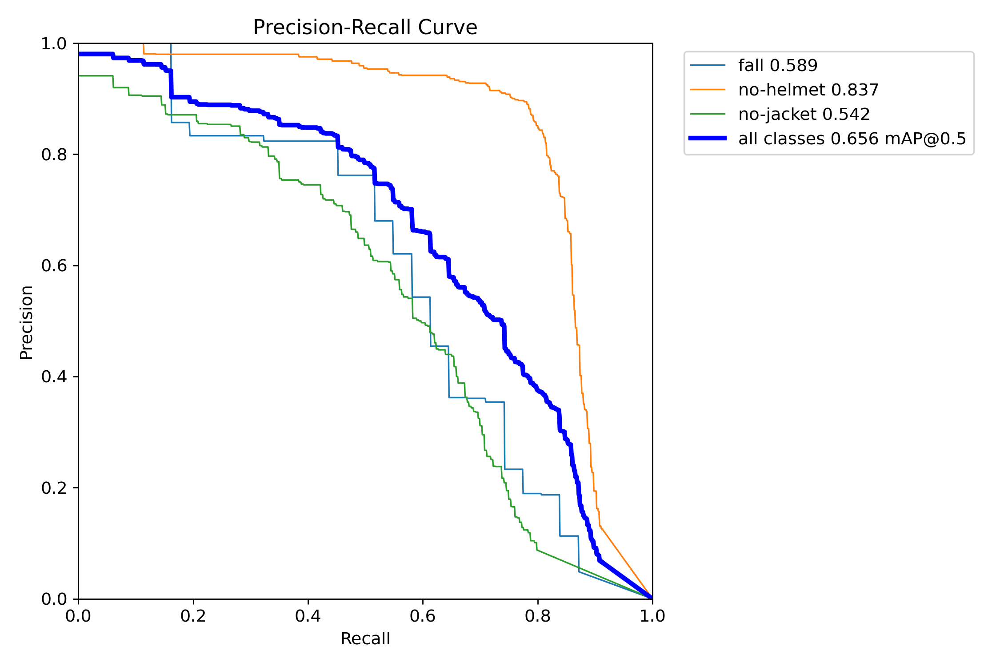
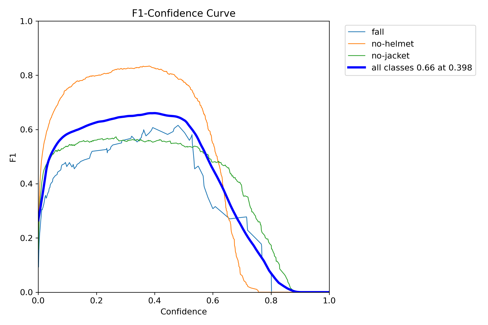
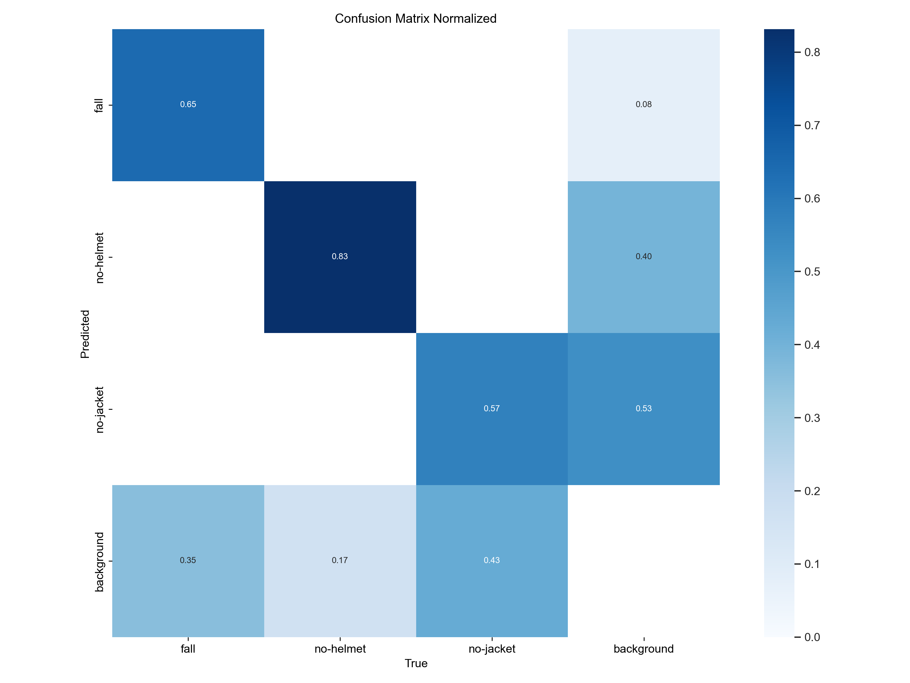
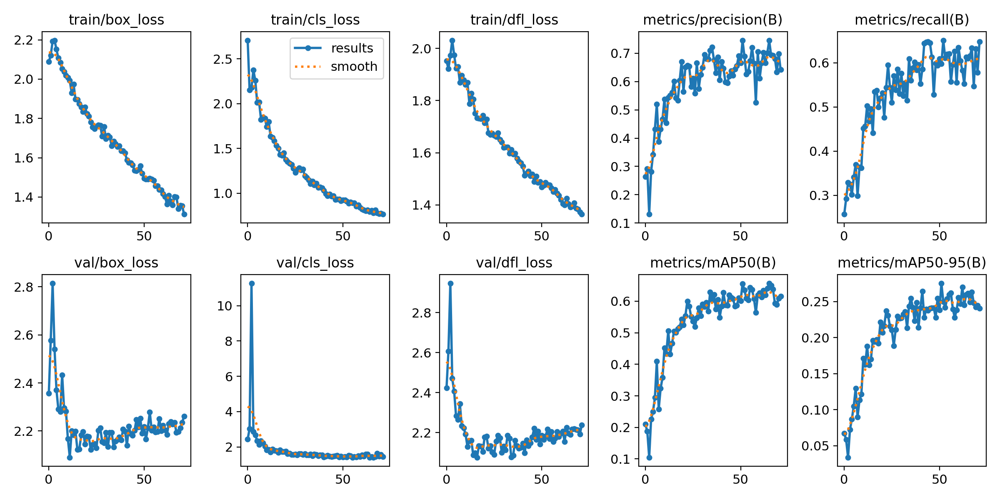

# Worksite Safety Monitor

Watches a worksite camera for missing hard hats and hi-vis jackets, for falls, and for two
arm/torso gestures, and turns what it sees into dated safety statistics an operator can chart,
export as a PDF and be emailed about.

Licensed under [AGPL-3.0-or-later](LICENSE). Derived work is recorded in [NOTICE](NOTICE).

---

## Architecture

Three modules, each independently runnable, joined by exactly two contracts: a Kafka topic and a
REST API.

```
  detector  (Python 3.11+, YOLOv8)          engine  (Java 17, Spring Boot 3.0.4)        web  (React)
  ─────────────────────────────────         ──────────────────────────────────────      ───────────
  camera or video file                                                                  charts
        │                                                                               events grid
        ├─ yolov8s-pose.pt  ─┐                                                          PDF report
        └─ best.pt          ─┤                                                                ▲
                             ▼                                                                │
                       rules: gestures,        Kafka topic          @KafkaListener             │
                       PPE windows,       ───"rawEvents"───►      RawEventService        REST + JWT
                       fall throttle          JSON events                │                     │
                             │                                           ▼                     │
                             │                                    MongoDB "event"  ────────────┘
                             │                                           ▲
                             └─ output_image.jpg ──► GET /event/get_image/{ts} ──► polled by the
                                (one file, rewritten every frame)                  browser
```

**detector** — `detector/src/worksite_detector/`. Runs two YOLO models on every frame: a stock
`yolov8s-pose.pt` for 17-keypoint poses, and `best.pt`, this project's fine-tune, for the
`no-helmet` / `no-jacket` / `fall` classes. Applies the rules, publishes JSON to Kafka, and writes
one annotated JPEG for the preview. Nothing but `adapters.py`, `annotate.py` and one classmethod in
`publisher.py` is allowed to import cv2, ultralytics, kafka or torch — enforced by an AST test — so
the rules are unit-testable on a machine with no CV stack at all.

**engine** — `engine/`. `RawEventService.listener` is the only consumer of `rawEvents` and the only
place events are stored. It is also where the business rules live: a `FALL` emails every registered
user; `NO_HELMET` / `NO_JACKET` are stored only if they lasted longer than
`event.periodic.min-duration-ms`; everything else is stored as it arrives. Everything after that is
read-only aggregation over the MongoDB `event` collection, served over REST behind a stateless JWT.

**web** — `web/`. React dashboard on Vite: the charts, the events grid, the PDF-report trigger and
the camera preview page. The engine's base URL is `VITE_API_URL`, baked in at build time.

There is no top-level build. Each module is started separately. A `docker-compose.yml` at the
repository root, with a Dockerfile per module, brings the whole stack up together — Kafka, MongoDB
and the three services — and feeds the detector a mounted video file rather than a camera. Copy
`.env.example` to `.env` first. That compose file is thoroughly commented and is the thing to read
before relying on it.

It has been brought up cold twice — clean build cache, no volumes — reaching all-healthy in about
15 seconds, with events arriving in MongoDB, the camera preview served, and an unauthenticated
request correctly refused. Two things about the demo are worth knowing before you read too much
into it. The bundled clip is **synthetic**, assembled from the sample images that ship inside the
`ultralytics` package, because no real worksite footage is redistributable; it produces genuine
detections, but it is not evidence about real sites. And because a video file's timestamps are
measured from the start of the clip rather than from the wall clock, events from a file are stored
against 1 January 1970 — so the dashboard's date range will look empty while the database is full.
Both are noted at the settings that cause them.

---

## Quick start: a dry run

`--dry-run` runs the entire detector — both models, every rule, the whole frame loop — and collects
the events in memory instead of publishing them. It contacts no broker, needs no Kafka client
library, and needs neither the engine, MongoDB nor the web app. It is the fastest way to see
whether this project works on your machine, and it is the first thing to try.

```bash
cd detector
python -m venv .venv
.venv/Scripts/activate            # Windows; use  source .venv/bin/activate  elsewhere
pip install -e ".[cv]"            # ultralytics, opencv-python, kafka-python-ng

python -m worksite_detector --dry-run --source path/to/clip.mp4
```

Two things must be on disk first: `detector/models/yolov8s-pose.pt` and `detector/models/best.pt`.
Neither is in git — `.gitignore` excludes `*.pt` — and they are deliberately **not** downloaded for
you, because ultralytics silently fetches any weights name it recognises and would run a stock model
in place of the one this project trained. If either is missing the detector refuses to start, names
both files, prints the working directory the relative paths resolved against, and points at the
release they are attached to.

`--source` takes a video file path, a stream URL, or a webcam index such as `0`; it defaults to `0`,
so a machine with no webcam needs a file. (No footage ships with this repository — worksite video of
identifiable people is not redistributable.) Add `--no-display` to skip writing the annotated preview
frame.

Output, abridged from a real run over a 60-frame clip:

```
dry run finished: 2 events collected from camera "clip.mp4", none published.

  event      count    first ms     last ms   observed ms
  NO_HELMET      1           0           0          5900
  NO_JACKET      1           0           0          5900

Nothing was sent to a broker. Drop --dry-run to publish these to topic 'rawEvents' at localhost:9092.
```

A run that finds nothing says so explicitly and names the two confidence gates a detection has to
clear, because "no events" and "not working" look identical from outside.

Exit codes (`detector/src/worksite_detector/__main__.py`): `0` clean shutdown, `2` the configuration
could not be resolved, `3` a resource a valid configuration named could not be opened, `130`
interrupted before the first frame. A misspelled setting is fatal and the error names the key:

```
$ WSM_KAFKA__BOOTSTRAP_SERVER=broker:9092 python -m worksite_detector --dry-run
worksite-detector: unknown configuration key 'WSM_KAFKA__BOOTSTRAP_SERVER (kafka.bootstrap_server)':
the 'kafka' section has no 'bootstrap_server' setting. It has ['bootstrap_servers', 'topic'].
```

Every setting is documented in [`detector/config.example.yaml`](detector/config.example.yaml), which
lists the built-in defaults and is parsed back and compared against them by the test suite, so it
cannot drift into fiction.

To run the whole system — Kafka, MongoDB, the engine and the dashboard — see
[docs/development.md](docs/development.md).

---

## What it detects

Five event types, in two families that the whole stack treats differently.

| Event | Family | Source | Aggregated as |
|---|---|---|---|
| `FALL` | countable | `best.pt` class `fall` | occurrences per day |
| `ARMS_UP` | countable | pose keypoints, shoulder angle | occurrences per day |
| `FRONT_BEND` | countable | pose keypoints, hip angle + upright precondition | occurrences per day |
| `NO_HELMET` | periodic | `best.pt` class `no-helmet` | summed duration per day |
| `NO_JACKET` | periodic | `best.pt` class `no-jacket` | summed duration per day |

Countable events carry no duration. Periodic events are emitted once per *violation window* — the
span from the first frame reporting the violation to the last, closed after the violation has been
absent for `ppe_grace_ms` (default 1500 ms). The engine stores a periodic event only if its duration
exceeds `event.periodic.min-duration-ms` (default 3000 ms).

The grace window is not cosmetic. On the recorded baseline clip the `no-jacket` detections arrive as
27 separate runs, the longest 367 ms; closing a window on the first clean frame produces 63 windows
and not one of them clears the engine's 3-second threshold. At 1500 ms the same footage yields one
coherent 6500 ms violation. See
[`detector/tests/data/baseline/PROVENANCE.md`](detector/tests/data/baseline/PROVENANCE.md).

---

## Model performance

`best.pt` is a YOLOv8m fine-tune over three classes, trained with
`epochs=150 patience=20 batch=8 imgsz=640` and early-stopped after 72 epochs (0–71). Hyperparameters
are in [`detector/training/train-args.yaml`](detector/training/train-args.yaml); the per-epoch
metrics behind every number below are in
[`detector/training/train-results.csv`](detector/training/train-results.csv).

Best epoch by ultralytics' fitness (epoch 51), on the validation split:

| metric | value |
|---|---|
| precision | 0.746 |
| recall | 0.598 |
| mAP@0.5 | 0.656 |
| mAP@0.5:0.95 | 0.275 |

Per class, mAP@0.5 (from the PR curve):

| class | mAP@0.5 | correctly predicted | missed as background |
|---|---|---|---|
| `no-helmet` | 0.837 | 0.83 | 0.17 |
| `fall` | 0.589 | 0.65 | 0.35 |
| `no-jacket` | 0.542 | 0.57 | 0.43 |
| **all classes** | **0.656** | | |

The last two columns are the normalised confusion matrix. Read them as the headline caveat: on the
validation split this model misses roughly a third of falls and over two fifths of missing jackets.
Helmets are the one class it is good at.

<p align="center">
  
  
</p>
<p align="center">
  
  
</p>

F1 peaks at 0.66 at a confidence of 0.398, while the detector's shipped `ppe_confidence` is 0.6 —
deliberately past the peak, trading recall for precision, because every stored violation is
something a person is asked to act on. Lowering `ppe_confidence` toward 0.4 will find more
violations and more false ones.

The training dataset is not distributed with this repository. Nothing from `runs/pose/` is published
as model performance: that directory was a `coco8-pose` demo against ultralytics' eight-image sample
set, not this project's model.

---

## Known limitations

These are measured, not guessed. They are the reason to trust the rest of this document.

**PPE violations are counted globally, not per person.** Three workers without helmets in one frame
produce one `NO_HELMET` window, not three. The system measures *that* a violation is happening and
for how long, never how many people are violating. Per-person attribution would need an identity the
pose stage does not produce.

**Person identity is not stable across frames.** The person id handed to the gesture rules is that
person's position in one frame's model output. There is no tracker behind it, so no id outlives the
frame that produced it, and gesture counters are approximate the moment more than one person is in
shot.

**Gesture detection is unproven on real footage.** Replaying 986 frames of a real worksite clip
emitted zero `ARMS_UP` and zero `FRONT_BEND` — because nobody in that clip raised their arms or bent
over. Over 1114 person-frames the arms angle spanned 0.1°–121.5° against a completion threshold of
140°, and the bend angle spanned 156.4°–179.6° against an arming threshold of 130°. The rules are
covered by synthetic unit tests; they have never been demonstrated end to end on video. A visibility
gate passing means a limb was seen, not that a gesture happened.

**`NO_HELMET` has no real-footage evidence either.** The baseline clip contains zero `no-helmet`
detections, so every helmet assertion in the suite is synthetic. See
[`DIFFERENTIAL.md`](detector/tests/data/baseline/DIFFERENTIAL.md) for what the recorded trace can and
cannot prove.

**The video "stream" is not a stream.** The detector overwrites a single `output_image.jpg` on disk
every frame; the engine serves that one file from a public, unauthenticated endpoint; the browser
polls it. There is no protocol, no buffering, and no way to seek.

**A `FALL` emails every registered user in the database.** Not a subscriber list, not a role — every
row in the users collection, on every fall that clears the detector's cooldown (default 3 minutes).

**One camera, one role, no refresh tokens, no schema registry.** `Role` has exactly one value,
`ADMIN`, so "admin-only" endpoints mean "any logged-in user". JWTs last 20 minutes and there is no
refresh flow — sessions simply end. The Kafka payload is plain JSON with no schema registry and no
authentication on the topic; the engine drops unparseable and unrecognised messages with a log line,
which is the only validation there is.

**A stream URL is stamped from media time.** Frame timestamps come from `CAP_PROP_POS_MSEC` for
anything non-numeric, so an RTSP/HTTP source that reports no position stamps every frame with the
same number and collapses every window and throttle. Use a numeric camera index or a recorded file.

---

## Security

Three credentials were committed to this repository's history: a Gmail app password, the JWT signing
key and the AES key behind password-reset links. The history has been rewritten, and **all three
must still be rotated or revoked** — rewriting does not un-leak anything already cloned.

Read [SECURITY.md](SECURITY.md) before deploying this anywhere, and to report a vulnerability.

---

## Documentation

| | |
|---|---|
| [docs/architecture.md](docs/architecture.md) | the event pipeline, the taxonomy, the auth flow, the contracts between the three modules |
| [docs/development.md](docs/development.md) | running each module, running the tests, adding a new event type |
| [CONTRIBUTING.md](CONTRIBUTING.md) | how to propose a change |
| [CHANGELOG.md](CHANGELOG.md) | what changed, release by release |
| [SECURITY.md](SECURITY.md) | reporting a vulnerability, and the credentials in the history |
| [detector/tests/data/baseline/](detector/tests/data/baseline/) | the recorded trace, its provenance, and the measured differential against the original implementation |

---

## License

GNU Affero General Public License v3.0 or later. The full text is in [LICENSE](LICENSE).

AGPL section 13 applies: if you run a modified version of this program and let users interact with it
over a network, you must offer those users the source of your modified version.

Derived work and its licences — Ultralytics YOLO (AGPL-3.0-or-later) and
yuyoujiang/Exercise-Counter-with-YOLOv8-on-NVIDIA-Jetson (Apache-2.0) — are recorded in
[NOTICE](NOTICE), with a copy of the Apache License at
[docs/third-party/apache-2.0.txt](docs/third-party/apache-2.0.txt).
